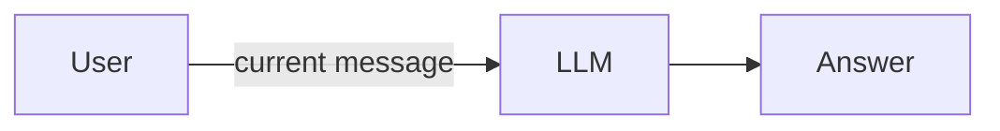

# 💬 Phase 1: Plain Chat

Baseline Chainlit chat backed by a GitHub Models LLM.

## 🆕 What's New

- Minimal chat interface with one model call per message
- This is the reference point – no memory, no tools

## ⚙️ How It Works

The application sends exactly two messages to the model on every turn: a system instruction and the current user message. Nothing else. The model has no idea what happened before – it sees each turn in complete isolation.

This is the simplest possible architecture: one request in, one response out. There is no state, no loop, and no external capability. Everything the model knows comes from its training data and the current prompt.



## 👀 What To Observe

- Each turn is handled independently
- Follow-up questions lose context
- The model answers only from its built-in knowledge

## 🤔 Think About

- What would you need to change so the model can answer follow-up questions?
- Is this system an "agent"? Why or why not?

## 💡 Try In Chat

```text
My name is Alex.
What is my name?
```

The second answer will not reliably remember the first message. The model is not broken – it simply never received the first message in the second turn.
