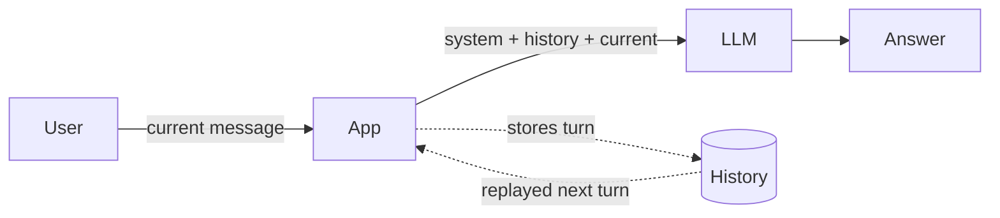

# 🧠 Phase 2: Chat with Memory

Same chat app, but now with conversation history.

## 🆕 What's New

- History list initialized in `on_chat_start`
- Previous messages replayed to the model on every turn
- History updated after each response

## ⚙️ How It Works

The model itself has no memory. It sees exactly what we send it – nothing more. By collecting previous messages in a list and replaying them on every turn, we simulate memory. The model doesn't "remember" – it re-reads the entire conversation every time.

This is a common pattern: the application manages state, not the model. The list of messages grows with each turn, and the model receives the full history as context. That is why follow-up questions suddenly work – the model can see what was said before because we explicitly include it.

The important insight: memory is an application-level concern, not a model capability. The model is still stateless – we just give it more context.



## 👀 What To Observe

- Follow-up questions work reliably
- The model can refer to things said earlier
- Memory improves continuity but does not add new capabilities

## 🤔 Think About

- What happens when the conversation gets very long? What are the limits?
- Memory makes the model more coherent – but can it now do anything it couldn't before?

## 💡 Try In Chat

```text
My name is Alex.
What is my name?
```

The second answer now works because the app sends prior messages back to the model. Compare this directly with Phase 1 – the model is the same, only the input changed.
