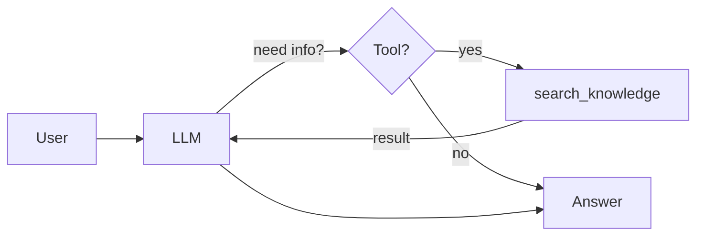

# 🛠️ Phase 3: Chat with Tool

The model can now call a local `search_knowledge` tool.

## 🆕 What's New

- `search_knowledge(query)` tool in `tools.py`
- LangChain agent with reasoning loop replaces direct `model.ainvoke()`
- Model decides when to call the tool

## ⚙️ How It Works

Until now, the model could only generate text from what it already knew. In this phase, the model gains a new ability: it can call a function. The key change is that `model.ainvoke()` is replaced by a LangChain agent with a reasoning loop.

The loop works like this: the model receives the user message and the tool description. It decides whether to answer directly or to call the tool first. If it calls the tool, the application executes the function and sends the result back to the model. The model then writes its final answer using that result.

This is the architectural shift that makes a system "agent-like": the model no longer just responds – it can decide, act, observe, and then respond. The tool itself is intentionally simple (keyword search over Markdown files) so the focus stays on the pattern, not the implementation.



## 👀 What To Observe

- Some questions trigger tool use (visible as a step in the Chainlit UI)
- The response flow becomes multi-step: decide, call tool, observe result, answer
- This is where the system starts to feel agent-like

## 🤔 Think About

- What makes the model decide to use the tool vs. answering directly?
- Could you add a second tool? What would change in the code?
- Is this system an agent now? What is still missing?

## 💡 Try In Chat

```text
What is MCP?
Summarize it in one sentence.
```

Watch the Chainlit UI for visible tool steps showing input and output. Try a question the knowledge base cannot answer and see how the model handles it.
