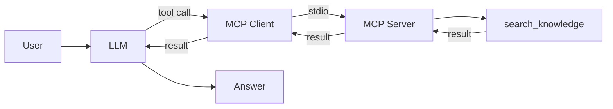

# 🔌 Phase 4: Chat with MCP Tool

Same knowledge search, but reached through MCP instead of a direct function call.

## 🆕 What's New

- `mcp_server.py` exposes the search as an MCP tool
- `app.py` loads MCP tools via `langchain-mcp-adapters` instead of defining them locally
- The MCP server starts automatically over stdio – no manual startup needed

## ⚙️ How It Works

In Phase 3, the tool was a Python function defined directly in the application. In this phase, the same function is wrapped in a small MCP server (`mcp_server.py`). The application no longer knows about the tool implementation – it discovers the tool at runtime through the MCP protocol.

The flow is: the application starts the MCP server as a subprocess, asks it "what tools do you have?", and receives a description. That description is converted into a LangChain tool via `langchain-mcp-adapters`. From the agent's perspective, it works the same as Phase 3 – but the tool now lives behind a protocol boundary.

This matters because it separates capability from integration. The knowledge search doesn't need to live in the same codebase. Any application that speaks MCP can discover and use it. That is the architectural value of standardized protocols – not better answers, but better boundaries.



## 👀 What To Observe

- The answers are similar to Phase 3 – the capability is the same
- The tool is now discovered and called through a protocol boundary
- Capability and transport are separate architectural concerns

## 🤔 Think About

- What would change if the MCP server ran on a different machine?
- Why is it useful that the application discovers the tool instead of hardcoding it?
- When is the extra complexity of MCP worth it, and when is a direct function call simpler?

## 💡 Try In Chat

```text
What is MCP?
What are AI agents?
```

Compare the behavior with Phase 3. The answers are similar, but the architecture is different. The tool name in the Chainlit UI now shows `search_knowledge_mcp`.
