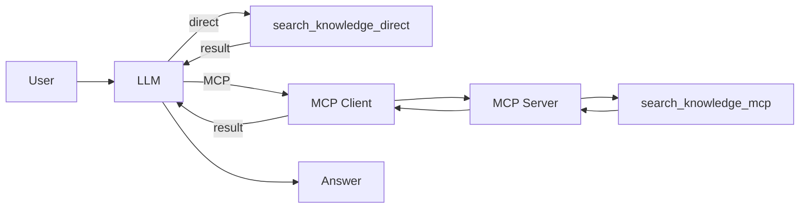

# 🔀 Phase 5: Compare Direct vs MCP

Both a direct local tool and an MCP tool are available in the same agent.

## 🆕 What's New

- `search_knowledge_direct` calls the Python function directly (like Phase 3)
- `search_knowledge_mcp` calls the same function through an MCP server (like Phase 4)
- The model can choose which path to use based on user instruction

## ⚙️ How It Works

This phase combines Phase 3 and Phase 4 into one agent. The model has two tools with different names but identical capability. When the user says "direct", the model calls the local Python function. When the user says "MCP", the call goes through the MCP server. When the user says "compare", the model uses both and explains the difference.

The point is not that one path is "better". Both return the same result. The point is that the architecture is different – and that difference becomes visible in the Chainlit UI (different tool names) and in how the code is structured (local function vs. protocol boundary).

This is the key takeaway of the workshop: architectural decisions are not about capability – they are about boundaries, composability, and where you want flexibility in your system.



## 👀 What To Observe

- The Chainlit UI shows which tool name was used
- The returned knowledge is the same – only the access path differs
- Asking for "compare" makes the architectural difference visible

## 🤔 Think About

- When would you choose MCP over a direct function call in a real system?
- What would happen if you added a third MCP server with a different capability?
- How does standardized tool access change the way teams can work independently?

## 💡 Try In Chat

```text
Use the direct tool to explain MCP.
Use MCP to explain MCP.
Compare both paths for the same question.
```

Watch the tool names in the Chainlit UI to see which path was taken. The answers should be nearly identical – the difference is in the architecture, not the output.
