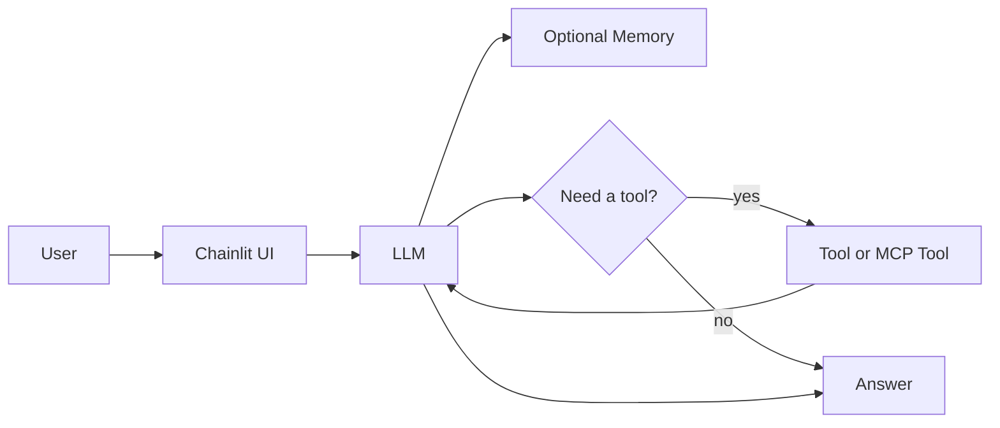

# Building AI Chat Agents

With LangChain, Chainlit, GitHub Models, Tools, and MCP

Technical workshop on how a chat system becomes agent-like through small architectural steps.

- 60 minutes
- Four runnable phases
- Local knowledge search
- Public, minimal, reproducible example
- Meierhoff Systems Lab

::: notes
Frame the session as architectural comparison, not feature building.
Participants should feel the difference between each phase, not just hear about it.
:::

---

## Why This Workshop Exists

- LLM chat is often labeled an "agent" too early
- The useful question is: what changed in the system?
- This workshop adds one capability at a time
- Participants compare code, behavior, and architecture after every phase

::: notes
Emphasize that the workshop is intentionally local and small.
The point is to make architecture inspectable.
:::

---

## What Is An AI Agent?

- A model alone is not the whole system
- Memory can preserve conversational state
- Tools extend capability beyond generation
- The key shift is a loop: decide, act, observe, respond

`Agent = LLM + Tools + Reasoning Loop`

::: notes
Keep the definition practical.
Memory is optional support. Tools and the loop are what make the architecture feel agent-like.
:::

---

## Phase 1 Plain Chat

- What was added: baseline Chainlit chat and one model call
- What stayed the same: no memory, no tools, one response step
- What behavior changed: none yet, this is plain chat only
- Why it matters: this is the reference point for every later comparison

What the code does:
- Sends the current message to the model
- Returns the model response directly

What participants should notice:
- Each turn stands alone
- Follow-up questions lose context

::: notes
Ask for a follow-up question like "now summarize that in one sentence."
The loss of context should be noticeable.
:::

---

## Phase 2 Memory

- What was added: conversation state in the current session
- What stayed the same: same UI, same model, still no tool use
- What behavior changed: prior turns now influence the next answer
- Why it matters: state changes behavior even before new capabilities are added

What the code does:
- Stores user and assistant messages
- Replays them on each model call

What participants should notice:
- Follow-up questions become coherent
- The chat feels less stateless

::: notes
Be explicit that memory is not yet a tool.
It improves continuity, but it does not let the system inspect the world.
:::

---

## Phase 3 Tools

- What was added: `search_knowledge(query)` plus tool binding and execution
- What stayed the same: same chat UI, same model, same memory pattern
- What behavior changed: the model can retrieve local knowledge before answering
- Why it matters: the system now uses an external capability, not only generation

`User -> UI -> LLM -> Tool Decision -> Tool Execution -> LLM -> Answer`

What the code does:
- Registers a local knowledge-search tool
- Executes tool calls and returns the result to the model

What participants should notice:
- Some questions trigger tool use
- The response loop is now multi-step

::: notes
This is the strongest behavioral shift in the workshop.
Participants should feel that the system is no longer "just chatting."
:::

---

## Phase 4 MCP

- What was added: MCP tool exposure, discovery, and invocation
- What stayed the same: same knowledge capability and same user-facing task
- What behavior changed: tool access becomes standardized and more extensible
- Why it matters: architecture can improve even when the capability stays the same

What the code does:
- Exposes the knowledge search through a tiny MCP server
- Connects through an MCP client instead of a direct function call

What participants should notice:
- User-facing behavior may look similar
- The integration boundary is cleaner and more interoperable

::: notes
Make the contrast explicit: phase 3 changes capability, phase 4 changes interface and architecture.
That distinction is important.
:::

---

## Recap And Discussion

Progression:

- `Chat -> Chat + Memory -> Chat + Tool -> Chat + Tool + MCP`
- Plain chat: response from the current prompt
- Memory: response shaped by prior turns
- Tools: response can use external capability
- MCP: tool access becomes standardized and easier to extend

`chat -> memory -> tool use -> standardized tool access`

Discussion prompts:

- When do you actually need an agent instead of plain chat?
- When is a workflow enough without tool choice?
- Where does MCP help in real systems?

::: notes
End by separating behavioral complexity from architectural complexity.
Not every useful system needs the full stack shown here.
:::
