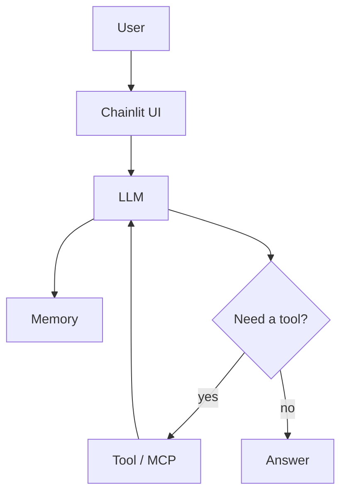

<style src="./theme.css"></style>

---
layout: cover
class: text-center
---

<div class="cover-content">

# Building AI Chat Agents

<p class="subtitle">LangChain &middot; Chainlit &middot; GitHub Models &middot; Tools &middot; MCP</p>

<div class="cover-meta">

<div v-click class="meta-item">60 minutes</div>
<div v-click class="meta-item">Four runnable phases</div>
<div v-click class="meta-item">Local knowledge search</div>

</div>

<p v-click class="cover-footer">Meierhoff Systems Lab</p>

</div>

::: notes
Frame the session as architectural comparison, not feature building.
Participants should feel the difference between each phase, not just hear about it.
:::

---
transition: fade-out
---

## Why This Workshop Exists

<v-clicks>

- LLM chat is often labeled an **"agent"** too early
- The useful question is: **what changed in the system?**
- This workshop adds one capability at a time
- Participants compare code, behavior, and architecture after every phase

</v-clicks>

::: notes
Emphasize that the workshop is intentionally local and small.
The point is to make architecture inspectable.
:::

---
layout: two-cols
layoutClass: gap-8
---

## What Is An AI Agent?

<v-clicks>

- A model alone is **not** the whole system
- Memory can preserve conversational state
- Tools extend capability beyond generation
- The key shift is a **loop**: decide, act, observe, respond

</v-clicks>

<div v-click class="agent-formula">

`Agent = LLM + Tools + Reasoning Loop`

</div>

::right::

<div v-click class="diagram-container">



</div>

::: notes
Keep the definition practical.
Memory is optional support. Tools and the loop are what make the architecture feel agent-like.
:::

---
layout: center
class: text-center
---

<div class="phase-divider">

# The Four Phases

<p class="phase-divider-sub">Each phase adds exactly one architectural change</p>

<div class="phase-pills" v-click>
  <span class="pill pill-1">Chat</span>
  <span class="pill-arrow">&rarr;</span>
  <span class="pill pill-2">Memory</span>
  <span class="pill-arrow">&rarr;</span>
  <span class="pill pill-3">Tools</span>
  <span class="pill-arrow">&rarr;</span>
  <span class="pill pill-4">MCP</span>
</div>

</div>

---

## Phase 1 &mdash; Plain Chat

<div class="phase-badge">Phase 1</div>

<div class="grid grid-cols-2 gap-8 mt-4">
<div>

**What changed**

<v-clicks>

- Baseline Chainlit chat and one model call
- No memory, no tools, one response step
- This is the **reference point** for every later comparison

</v-clicks>

</div>
<div>

**What to notice**

<v-clicks>

- Each turn stands alone
- Follow-up questions **lose context**
- Ask: *"now summarize that in one sentence"*

</v-clicks>

</div>
</div>

<div v-click class="phase-code-hint">

```
User  →  LLM  →  Answer
```

</div>

::: notes
Ask for a follow-up question like "now summarize that in one sentence."
The loss of context should be noticeable.
:::

---

## Phase 2 &mdash; Memory

<div class="phase-badge">Phase 2</div>

<div class="grid grid-cols-2 gap-8 mt-4">
<div>

**What changed**

<v-clicks>

- Conversation state in the current session
- Same UI, same model, still no tool use
- Prior turns now **influence** the next answer

</v-clicks>

</div>
<div>

**What to notice**

<v-clicks>

- Follow-up questions become **coherent**
- The chat feels less stateless
- State changes behavior even before new capabilities

</v-clicks>

</div>
</div>

<div v-click class="phase-code-hint">

```
User  →  LLM + History  →  Answer
```

</div>

::: notes
Be explicit that memory is not yet a tool.
It improves continuity, but it does not let the system inspect the world.
:::

---

## Phase 3 &mdash; Tools

<div class="phase-badge">Phase 3</div>

<div class="grid grid-cols-2 gap-8 mt-4">
<div>

**What changed**

<v-clicks>

- `search_knowledge(query)` plus tool binding
- Same chat UI, same model, same memory
- The model can **retrieve local knowledge** before answering

</v-clicks>

</div>
<div>

**What to notice**

<v-clicks>

- Some questions **trigger tool use**
- The response loop is now **multi-step**
- The system is no longer "just chatting"

</v-clicks>

</div>
</div>

<div v-click class="phase-code-hint">

```
User  →  LLM  →  Tool Decision  →  Tool Exec  →  LLM  →  Answer
```

</div>

::: notes
This is the strongest behavioral shift in the workshop.
Participants should feel that the system is no longer "just chatting."
:::

---

## Phase 4 &mdash; MCP

<div class="phase-badge">Phase 4</div>

<div class="grid grid-cols-2 gap-8 mt-4">
<div>

**What changed**

<v-clicks>

- MCP tool exposure, discovery, and invocation
- Same knowledge capability, same user-facing task
- Tool access becomes **standardized** and extensible

</v-clicks>

</div>
<div>

**What to notice**

<v-clicks>

- User-facing behavior may look **similar**
- The integration boundary is **cleaner**
- Architecture improves even when capability stays the same

</v-clicks>

</div>
</div>

<div v-click class="phase-code-hint">

```
User  →  LLM  →  MCP Client  →  MCP Server  →  Tool  →  LLM  →  Answer
```

</div>

::: notes
Make the contrast explicit: phase 3 changes capability, phase 4 changes interface and architecture.
That distinction is important.
:::

---
layout: center
---

## Recap

<div class="recap-grid">

<div v-click class="recap-card">
  <div class="recap-label">Phase 1</div>
  <div class="recap-title">Plain Chat</div>
  <div class="recap-desc">Response from the current prompt</div>
</div>

<div v-click class="recap-card">
  <div class="recap-label">Phase 2</div>
  <div class="recap-title">Memory</div>
  <div class="recap-desc">Response shaped by prior turns</div>
</div>

<div v-click class="recap-card">
  <div class="recap-label">Phase 3</div>
  <div class="recap-title">Tools</div>
  <div class="recap-desc">Response can use external capability</div>
</div>

<div v-click class="recap-card">
  <div class="recap-label">Phase 4</div>
  <div class="recap-title">MCP</div>
  <div class="recap-desc">Tool access becomes standardized</div>
</div>

</div>

---

## Discussion

<v-clicks>

- When do you actually need an **agent** instead of plain chat?
- When is a **workflow** enough without tool choice?
- Where does **MCP** help in real systems?
- What's the minimal architecture for **your** use case?

</v-clicks>

<div v-click class="discussion-cta">

**The right amount of complexity is the minimum needed for the current task.**

</div>

::: notes
End by separating behavioral complexity from architectural complexity.
Not every useful system needs the full stack shown here.
:::
