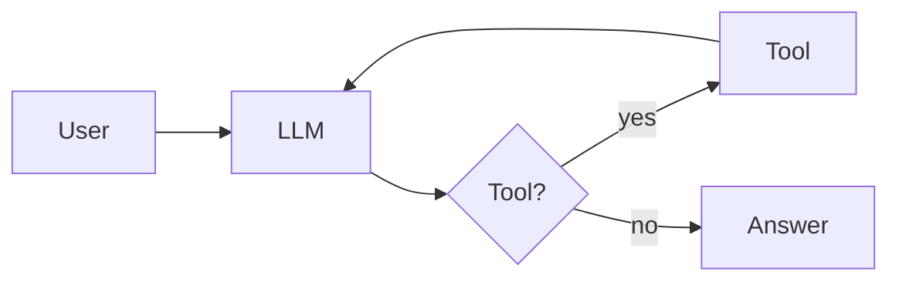

# Building AI Chat Agents

LangChain &middot; Chainlit &middot; GitHub Models &middot; Tools &middot; MCP

60 minutes

Four phases

Local knowledge search

Meierhoff Systems Lab

---
transition: fade-out
---

## Why This Workshop Exists

<v-clicks>

- LLM chat is often labeled an **"agent"** too early
- The useful question is: **what changed in the system?**
- This workshop adds one capability at a time
- Participants compare code, behavior, and architecture after every phase

</v-clicks>

 Meierhoff Systems Lab

---
layout: two-cols
layoutClass: gap-8
---

## What Is An AI Agent?

<v-clicks>

- A model alone is **not** the whole system
- Memory can preserve conversational state
- Tools extend capability beyond generation
- The key shift is a **loop**: decide, act, observe, respond

</v-clicks>

`Agent = LLM + Tools + Reasoning Loop`

::right::

 Meierhoff Systems Lab

---
layout: center
class: text-center
---

# The Four Phases

Each phase adds exactly one architectural change

  Chat
  &rarr;
  Memory
  &rarr;
  Tools
  &rarr;
  MCP

 Meierhoff Systems Lab

---

## Phase 1 &mdash; Plain Chat

Phase 1

What changed

<v-clicks>

- Baseline Chainlit chat and one model call
- No memory, no tools, one response step
- This is the **reference point** for every later comparison

</v-clicks>

What to notice

<v-clicks>

- Each turn stands alone
- Follow-up questions **lose context**
- Ask: *"now summarize that in one sentence"*

</v-clicks>

  User
  &rarr;
  LLM
  &rarr;
  Answer

 Meierhoff Systems Lab

---

## Phase 2 &mdash; Memory

Phase 2

What changed

<v-clicks>

- Conversation state in the current session
- Same UI, same model, still no tool use
- Prior turns now **influence** the next answer

</v-clicks>

What to notice

<v-clicks>

- Follow-up questions become **coherent**
- The chat feels less stateless
- State changes behavior even before new capabilities

</v-clicks>

  User
  &rarr;
  LLM + History
  &rarr;
  Answer

 Meierhoff Systems Lab

---

## Phase 3 &mdash; Tools

Phase 3

What changed

<v-clicks>

- `search_knowledge(query)` plus tool binding
- Same chat UI, same model, same memory
- The model can **retrieve local knowledge** before answering

</v-clicks>

What to notice

<v-clicks>

- Some questions **trigger tool use**
- The response loop is now **multi-step**
- The system is no longer "just chatting"

</v-clicks>

  User
  &rarr;
  LLM
  &rarr;
  Tool
  &rarr;
  LLM
  &rarr;
  Answer

 Meierhoff Systems Lab

---

## Phase 4 &mdash; MCP

Phase 4

What changed

<v-clicks>

- MCP tool exposure, discovery, and invocation
- Same knowledge capability, same user-facing task
- Tool access becomes **standardized** and extensible

</v-clicks>

What to notice

<v-clicks>

- User-facing behavior may look **similar**
- The integration boundary is **cleaner**
- Architecture improves even when capability stays the same

</v-clicks>

  User
  &rarr;
  LLM
  &rarr;
  MCP Client
  &rarr;
  MCP Server
  &rarr;
  LLM
  &rarr;
  Answer

 Meierhoff Systems Lab

---
layout: center
---

## Recap

  
01

  
Plain Chat

  
Response from the current prompt

  
02

  
Memory

  
Response shaped by prior turns

  
03

  
Tools

  
Response can use external capability

  
04

  
MCP

  
Tool access becomes standardized

 Meierhoff Systems Lab

---

## Discussion

<v-clicks>

- When do you actually need an **agent** instead of plain chat?
- When is a **workflow** enough without tool choice?
- Where does **MCP** help in real systems?
- What's the minimal architecture for **your** use case?

</v-clicks>

**The right amount of complexity is the minimum needed for the current task.**

 Meierhoff Systems Lab

