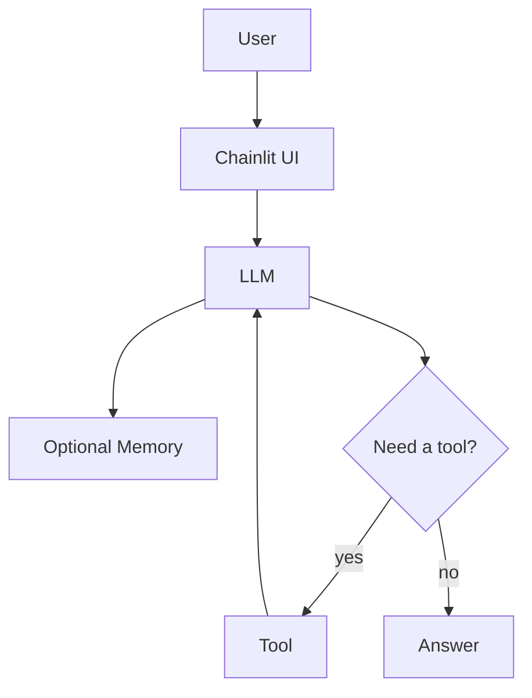

# Building AI Chat Agents

LangChain &middot; Chainlit &middot; GitHub Models &middot; Tools &middot; MCP

60 minutes

Four phases

Local knowledge search

Meierhoff Systems Lab

---
transition: fade-out
layout: two-cols
layoutClass: gap-8
---

## Why This Workshop Exists

- LLM chat is often labeled an **"agent"** too early
- The useful question is: **what changed in the system?**
- This workshop adds one capability at a time
- We alternate between short explanation and live coding
- Participants compare code, behavior, and architecture after every phase

::right::

<svg class="phase-progress-svg" viewBox="0 0 110 90" fill="none" xmlns="http://www.w3.org/2000/svg">
  <!-- Step 1 -->
  <rect x="5" y="70" width="22" height="15" rx="3" fill="#162132" stroke="#388bd2" stroke-width="0.6"/>
  <text x="16" y="79.5" text-anchor="middle" fill="#7cc4f5" font-size="3.2" font-weight="600" font-family="Inter, sans-serif">Chat</text>

  <!-- Step 2 -->
  <rect x="30" y="52" width="22" height="33" rx="3" fill="#162132" stroke="#388bd2" stroke-width="0.6"/>
  <text x="41" y="62" text-anchor="middle" fill="#7cc4f5" font-size="3.2" font-weight="600" font-family="Inter, sans-serif">Memory</text>

  <!-- Step 3 -->
  <rect x="55" y="35" width="22" height="50" rx="3" fill="#162132" stroke="#e8914f" stroke-width="0.6"/>
  <text x="66" y="45" text-anchor="middle" fill="#e8914f" font-size="3.2" font-weight="600" font-family="Inter, sans-serif">Tools</text>

  <!-- Step 4 -->
  <rect x="80" y="17" width="22" height="68" rx="3" fill="#162132" stroke="#e8914f" stroke-width="0.6"/>
  <text x="91" y="27" text-anchor="middle" fill="#e8914f" font-size="3.2" font-weight="600" font-family="Inter, sans-serif">MCP</text>

  <!-- Arrow line -->
  <path d="M16 69 C30 58, 48 45, 64 33 S84 18, 92 12" stroke="#388bd2" stroke-width="0.7" stroke-dasharray="2.5 2" stroke-linecap="round" fill="none" opacity="0.45"/>
  <polygon points="96,9 89,12 93,18" fill="#388bd2" opacity="0.45"/>
</svg>

 Meierhoff Systems Lab

---
layout: two-cols
layoutClass: gap-8
---

## What Is An AI Agent?

- A model alone is **not** the whole system
- Memory can preserve conversational state
- Tools extend capability beyond generation
- The key shift is a **loop**: decide, act, observe, respond

`Agent = LLM + Tools + Reasoning Loop`

::right::

 Meierhoff Systems Lab

---
layout: center
class: text-center
---

# The Four Phases

Each phase adds exactly one architectural change

  Chat
  &rarr;
  Memory
  &rarr;
  Tools
  &rarr;
  MCP

 Meierhoff Systems Lab

---

## Phase 1 &mdash; Plain Chat

Phase 1

What was added

- Baseline Chainlit chat
- One model call per user message

What stayed the same

- No memory
- No tools
- One response step only

What behavior changed

- None yet
- This is plain chat only
- Each turn stands alone

Why it matters

- This is the reference point for the workshop
- It shows what plain chat can and cannot do
- The limitations are visible immediately

  User
  &rarr;
  LLM
  &rarr;
  Answer

 Meierhoff Systems Lab

<!--
After this slide, switch into the first live-coding step.
Use a simple follow-up question to make the missing context visible.
-->

---

## Phase 2 &mdash; Memory

Phase 2

What was added

- Conversation state in the current session
- Previous messages are replayed to the model

What stayed the same

- Same UI
- Same model
- Still no tool use

What behavior changed

- Prior turns now influence the next answer
- Follow-up questions become more coherent
- The system feels less stateless

Why it matters

- Participants can feel that state changes behavior
- Memory improves continuity before any tool is introduced
- It separates statefulness from tool use

  User
  &rarr;
  LLM + History
  &rarr;
  Answer

 Meierhoff Systems Lab

<!--
Compare Phase 1 and Phase 2 with the same follow-up prompt.
Stress that memory changes continuity, not capability.
-->

---

## Phase 3 &mdash; Tools

Phase 3

What was added

- `search_knowledge(query)`
- Tool binding and tool execution loop

What stayed the same

- Same chat UI
- Same model
- Same memory pattern

What behavior changed

- The model can retrieve local knowledge before answering
- Some questions now trigger tool use
- The response loop becomes multi-step

Why it matters

- This is where the system starts to feel agent-like
- The model is no longer limited to prompt plus memory
- Tool use changes both behavior and architecture

  User
  &rarr;
  LLM
  &rarr;
  Tool
  &rarr;
  LLM
  &rarr;
  Answer

 Meierhoff Systems Lab

<!--
Switch here from explanation to code inspection.
Show where the tool is registered and where the loop executes it.
-->

---

## Phase 4 &mdash; MCP

Phase 4

What was added

- MCP tool exposure
- MCP discovery and invocation

What stayed the same

- Same knowledge capability
- Same user-facing task
- Same general tool-augmented interaction

What behavior changed

- User-facing answers may look similar
- Tool access becomes more standardized
- The integration boundary becomes cleaner

Why it matters

- Participants can separate capability from protocol
- MCP matters for architecture and interoperability
- The same capability can be exposed through a cleaner interface boundary

  User
  &rarr;
  LLM
  &rarr;
  MCP Client
  &rarr;
  MCP Server
  &rarr;
  LLM
  &rarr;
  Answer

 Meierhoff Systems Lab

<!--
Use this phase to distinguish capability from integration pattern.
The behavior may look similar, but the architecture is different.
-->

---
layout: center
---

## Recap

`Chat -> Chat + Memory -> Chat + Tool -> Chat + Tool + MCP`

  
01

  
Plain Chat

  
Response from the current prompt

  
02

  
Memory

  
Response shaped by prior turns

  
03

  
Tools

  
Response can use external capability

  
04

  
MCP

  
Tool access becomes standardized

 Meierhoff Systems Lab

---

## Discussion

- When do you actually need an **agent** instead of plain chat?
- When is a **workflow** enough without tool choice?
- Where does **MCP** help in real systems?
- What's the minimal architecture for **your** use case?

**The right amount of complexity is the minimum needed for the current task.**

 Meierhoff Systems Lab

