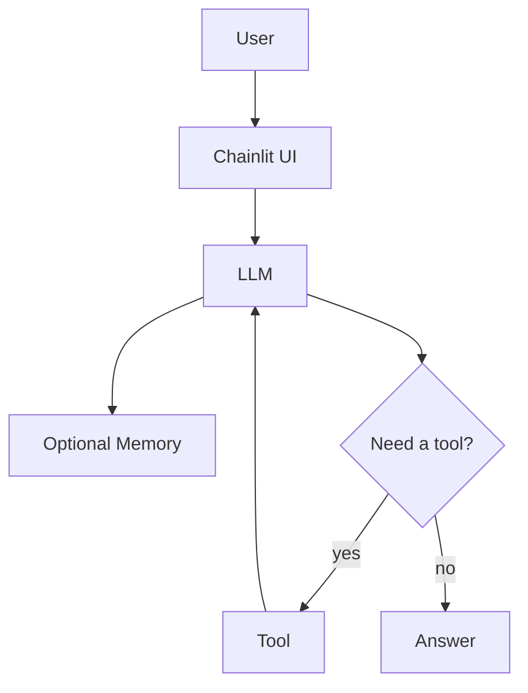

# Building AI Chat Agents

LangChain &middot; Chainlit &middot; GitHub Models &middot; Tools &middot; MCP

60 minutes

Four phases

Local knowledge search

Meierhoff Systems Lab

---
transition: fade-out
---

## Why This Workshop Exists

<v-clicks>

- LLM chat is often labeled an **"agent"** too early
- The useful question is: **what changed in the system?**
- This workshop adds one capability at a time
- We alternate between short explanation and live coding
- Participants compare code, behavior, and architecture after every phase

</v-clicks>

 Meierhoff Systems Lab

---
layout: two-cols
layoutClass: gap-8
---

## What Is An AI Agent?

<v-clicks>

- A model alone is **not** the whole system
- Memory can preserve conversational state
- Tools extend capability beyond generation
- The key shift is a **loop**: decide, act, observe, respond

</v-clicks>

`Agent = LLM + Tools + Reasoning Loop`

::right::

 Meierhoff Systems Lab

---
layout: center
class: text-center
---

# The Four Phases

Each phase adds exactly one architectural change

  Chat
  &rarr;
  Memory
  &rarr;
  Tools
  &rarr;
  MCP

 Meierhoff Systems Lab

---

## Phase 1 &mdash; Plain Chat

Phase 1

What was added

<v-clicks>

- Baseline Chainlit chat
- One model call per user message

</v-clicks>

What stayed the same

<v-clicks>

- No memory
- No tools
- One response step only

</v-clicks>

What behavior changed

<v-clicks>

- None yet
- This is plain chat only
- Each turn stands alone

</v-clicks>

Why it matters

<v-clicks>

- This is the reference point for the workshop
- Participants can feel what the system cannot yet do
- Good moment to switch into the first live-coding step

</v-clicks>

  User
  &rarr;
  LLM
  &rarr;
  Answer

 Meierhoff Systems Lab

---

## Phase 2 &mdash; Memory

Phase 2

What was added

<v-clicks>

- Conversation state in the current session
- Previous messages are replayed to the model

</v-clicks>

What stayed the same

<v-clicks>

- Same UI
- Same model
- Still no tool use

</v-clicks>

What behavior changed

<v-clicks>

- Prior turns now influence the next answer
- Follow-up questions become more coherent
- The system feels less stateless

</v-clicks>

Why it matters

<v-clicks>

- Participants can feel that state changes behavior
- Memory improves continuity before any tool is introduced
- Good moment to compare Phase 1 and Phase 2 live

</v-clicks>

  User
  &rarr;
  LLM + History
  &rarr;
  Answer

 Meierhoff Systems Lab

---

## Phase 3 &mdash; Tools

Phase 3

What was added

<v-clicks>

- `search_knowledge(query)`
- Tool binding and tool execution loop

</v-clicks>

What stayed the same

<v-clicks>

- Same chat UI
- Same model
- Same memory pattern

</v-clicks>

What behavior changed

<v-clicks>

- The model can retrieve local knowledge before answering
- Some questions now trigger tool use
- The response loop becomes multi-step

</v-clicks>

Why it matters

<v-clicks>

- This is where the system starts to feel agent-like
- The model is no longer limited to prompt plus memory
- Good moment to switch from explanation to code inspection

</v-clicks>

  User
  &rarr;
  LLM
  &rarr;
  Tool
  &rarr;
  LLM
  &rarr;
  Answer

 Meierhoff Systems Lab

---

## Phase 4 &mdash; MCP

Phase 4

What was added

<v-clicks>

- MCP tool exposure
- MCP discovery and invocation

</v-clicks>

What stayed the same

<v-clicks>

- Same knowledge capability
- Same user-facing task
- Same general tool-augmented interaction

</v-clicks>

What behavior changed

<v-clicks>

- User-facing answers may look similar
- Tool access becomes more standardized
- The integration boundary becomes cleaner

</v-clicks>

Why it matters

<v-clicks>

- Participants can separate capability from protocol
- MCP matters for architecture and interoperability
- Good final comparison point before recap and discussion

</v-clicks>

  User
  &rarr;
  LLM
  &rarr;
  MCP Client
  &rarr;
  MCP Server
  &rarr;
  LLM
  &rarr;
  Answer

 Meierhoff Systems Lab

---
layout: center
---

## Recap

`Chat -> Chat + Memory -> Chat + Tool -> Chat + Tool + MCP`

  
01

  
Plain Chat

  
Response from the current prompt

  
02

  
Memory

  
Response shaped by prior turns

  
03

  
Tools

  
Response can use external capability

  
04

  
MCP

  
Tool access becomes standardized

 Meierhoff Systems Lab

---

## Discussion

<v-clicks>

- When do you actually need an **agent** instead of plain chat?
- When is a **workflow** enough without tool choice?
- Where does **MCP** help in real systems?
- What's the minimal architecture for **your** use case?

</v-clicks>

**The right amount of complexity is the minimum needed for the current task.**

 Meierhoff Systems Lab

