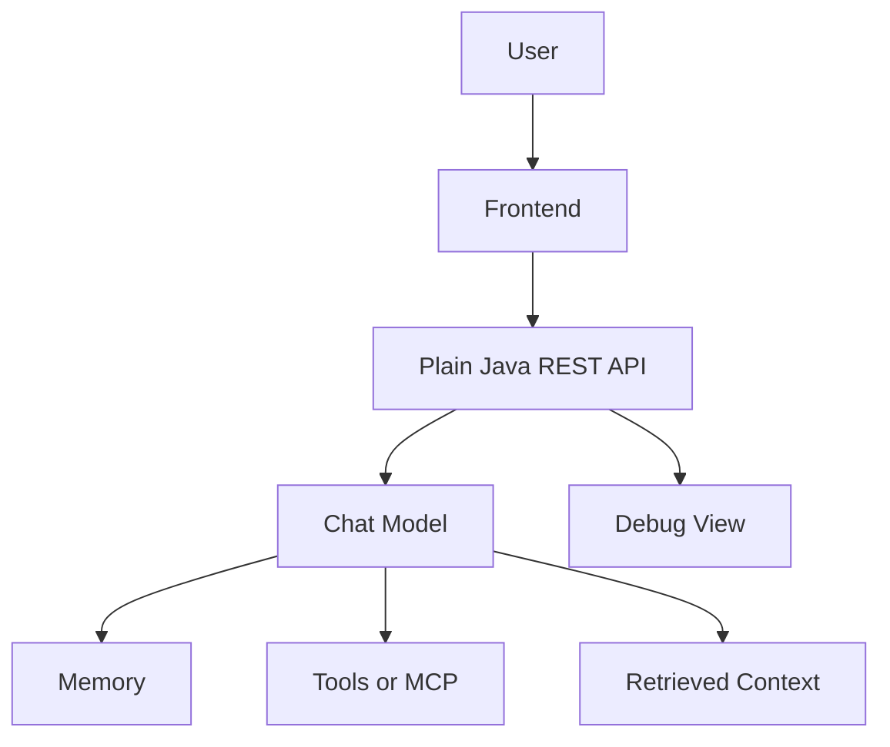
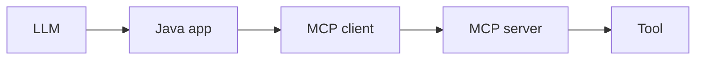

<style src="./theme.css"></style>

<div class="cover-content">

<div class="cover-glow"></div>

# Building AI Chat Agents in Plain Java

<p class="subtitle">LangChain4j · Java 21+ · Tools · MCP · RAG</p>

<div class="cover-meta">
<div class="meta-item">10 to 15 minutes</div>
<div class="meta-item">Five core capabilities</div>
<div class="meta-item">Visible architecture</div>
</div>

<p class="cover-footer">Meierhoff Systems Lab</p>

</div>

---
transition: fade-out
layout: two-cols
layoutClass: gap-8
---

## Why This Workshop Exists

- Many teams want **agent concepts** without adopting a full framework stack
- The useful question is: **what changed in the architecture?**
- This workshop keeps learning concepts visible and glue code hidden
- Each phase adds one capability and exposes it in a debug panel
- The result is a JVM-friendly mental model for chat agents

::right::



<div class="brand-footer"><span class="brand-dot"></span> Meierhoff Systems Lab</div>

---
layout: two-cols
layoutClass: gap-8
---

## What Is LangChain4j?

- A Java library for building LLM-powered applications
- Gives us a common API for chat models, embeddings, and retrieval
- Lets us expose Java methods as tools
- Supports higher-level service abstractions without forcing Spring or Quarkus

<div class="agent-formula">

`Agent = Chat Model + Memory + Tools + Retrieval + Orchestration`

</div>

::right::

<div class="stack-card">

### Why it fits this workshop

- Java-native code
- small API surface
- readable incremental examples
- good bridge between architecture and implementation

</div>

<div class="brand-footer"><span class="brand-dot"></span> Meierhoff Systems Lab</div>

---
layout: center
class: text-center
---

<div class="section-heading">

# The Workshop Capabilities

<p class="section-heading-sub">Each capability changes the system in a specific, observable way</p>

<div class="phase-pills">
  <span class="pill pill-active">Chat</span>
  <span class="pill-arrow">&rarr;</span>
  <span class="pill">Memory</span>
  <span class="pill-arrow">&rarr;</span>
  <span class="pill">Tool</span>
  <span class="pill-arrow">&rarr;</span>
  <span class="pill">MCP</span>
  <span class="pill-arrow">&rarr;</span>
  <span class="pill">RAG</span>
</div>

</div>

<div class="brand-footer"><span class="brand-dot"></span> Meierhoff Systems Lab</div>

---

## Core Feature 1: Chat Model

<div class="phase-badge">Baseline</div>

<div class="grid grid-cols-2 gap-10 mt-6">
<div>

<div class="col-heading">What it gives us</div>

- plain prompt in
- plain answer out
- one request/response loop

</div>
<div>

<div class="col-heading col-heading-warm">What it does not give us</div>

- no remembered state
- no deterministic capability
- no knowledge of local workshop files

</div>
</div>

<div class="note-panel mt-8">
Plain chat is the baseline we compare everything else against.
</div>

<div class="brand-footer"><span class="brand-dot"></span> Meierhoff Systems Lab</div>

---

## Core Feature 2: Memory

<div class="phase-badge">State</div>

- Memory replays prior turns into the next prompt
- Follow-up questions become coherent
- The debug panel makes the memory window inspectable

<div class="flow">
  <span class="flow-node">User</span>
  <span class="flow-arrow">&rarr;</span>
  <span class="flow-node flow-node-accent">LLM</span>
  <span class="flow-arrow">&harr;</span>
  <span class="flow-node">Memory</span>
</div>

<blockquote>
Memory improves continuity, but it does not solve missing local knowledge.
</blockquote>

<div class="brand-footer"><span class="brand-dot"></span> Meierhoff Systems Lab</div>

---

## Core Feature 3: Tools

<div class="phase-badge">Determinism</div>

- Java methods become callable by the model
- Great for time, calculation, and controlled side effects
- The model decides when to call the tool
- The application records arguments and results in debug output

```java
@Tool("Returns the current time in Europe/Berlin.")
String currentTime() { ... }
```

<div class="note-panel mt-6">
Tools change capability more than prompt wording alone because the system can now act, not just describe.
</div>

<div class="brand-footer"><span class="brand-dot"></span> Meierhoff Systems Lab</div>

---

## Core Feature 4: MCP

<div class="phase-badge">Protocol</div>

<div class="grid grid-cols-2 gap-10 mt-6">
<div>

<div class="col-heading">Direct tool usage</div>

- app owns the Java method
- easiest mental model
- best for local workshop demos

</div>
<div>

<div class="col-heading col-heading-warm">MCP</div>

- tool can live outside the app
- protocol-based discovery and invocation
- useful when multiple clients should share the same tool surface

</div>
</div>



<div class="brand-footer"><span class="brand-dot"></span> Meierhoff Systems Lab</div>

---

## Core Feature 5: RAG

<div class="phase-badge">Grounding</div>

- Retrieval searches local notes before answering
- Retrieved chunks become part of the prompt
- Source context becomes visible in the answer and in the debug inspector

<div v-click class="note-panel mt-6">
This matters because the workshop contains niche local facts such as the HH Nerd Gruppe context and the positioning against the earlier Python workshop.
</div>

<div v-click class="agent-formula mt-6">

`embed question -> retrieve chunks -> augment prompt -> answer`

</div>

<div class="brand-footer"><span class="brand-dot"></span> Meierhoff Systems Lab</div>

---
layout: two-cols
layoutClass: gap-8
---

## What LangChain4j Does Well

- Java integration feels natural
- plain service APIs are easy to teach
- chat, tools, memory, and retrieval fit one mental model
- good choice for assistants inside JVM applications

::right::

## What It Does Not Do Especially Well

- not a full graph orchestration system like LangGraph
- smaller ecosystem than Python tooling
- less built-in observability depth than LangSmith

<div class="brand-footer"><span class="brand-dot"></span> Meierhoff Systems Lab</div>

---
layout: two-cols
layoutClass: gap-8
---

## Comparison

### LangChain4j

- Java-first
- readable service abstractions
- strong fit for JVM teams

### LangChain Python

- broader ecosystem
- faster experimentation
- more examples and integrations

::right::

## Java Stack Positioning

- **LangChain4j** for Java-native building blocks
- **Spring AI** when Spring integration is the main concern
- **LangGraph4j** when workflow-style orchestration is central
- **Langfuse** when tracing and evaluation matter

<div class="brand-footer"><span class="brand-dot"></span> Meierhoff Systems Lab</div>

---

## When To Use It

- Use LangChain4j when your team already lives in Java
- Use it when you want architecture visibility without framework magic
- Use it when chat, tools, and retrieval are enough to solve the problem

<blockquote>
Do not choose it because "agents are trendy." Choose it because the abstraction level matches the problem and the stack fits your team.
</blockquote>

<div class="brand-footer"><span class="brand-dot"></span> Meierhoff Systems Lab</div>

---
layout: center
class: text-center
---

# Takeaway

LangChain4j is a strong fit for a plain-Java workshop because it makes the useful capabilities visible:

- chat model
- memory
- tools
- MCP
- RAG

The workshop works when participants can answer one question at the end:

**Which capability changed the system, and why?**

<div class="brand-footer"><span class="brand-dot"></span> Meierhoff Systems Lab</div>
