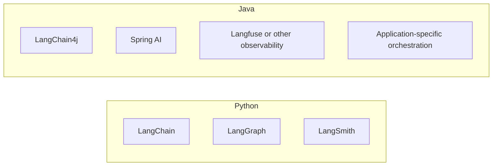

<style src="./theme.css"></style>

<div class="cover-content">

<div class="cover-glow"></div>

# LangChain4j Overview

<p class="subtitle">Capabilities · Limits · Maturity · Java vs Python</p>

<div class="cover-meta">
<div class="meta-item">10 to 15 minutes</div>
<div class="meta-item">Java AI landscape</div>
<div class="meta-item">Reality check included</div>
</div>

<p class="cover-footer">Meierhoff Systems Lab</p>

</div>

---
transition: fade-out
layout: two-cols
layoutClass: gap-8
---

## What Is LangChain4j?

- A Java-first library for building LLM-powered applications
- Gives one API surface for models, tools, memory, embeddings, retrieval, and MCP
- Works with plain Java, but also integrates with larger Java stacks
- Strong focus on developer ergonomics through `AI Services`

::right::

<div class="stack-card">

### Short positioning

- not a full Java clone of the Python LangChain ecosystem
- more than a model client
- especially strong for practical JVM application integration

</div>

<div class="agent-formula mt-8">

`Chat Model + AI Service + Tools + Memory + Retrieval`

</div>

<div class="brand-footer"><span class="brand-dot"></span> Meierhoff Systems Lab</div>

---
layout: center
class: text-center
---

<div class="section-heading">

# What Can It Do?

<p class="section-heading-sub">LangChain4j already covers most building blocks for modern LLM applications in Java</p>

</div>

<div class="phase-pills">
  <span class="pill pill-active">Chat Models</span>
  <span class="pill">AI Services</span>
  <span class="pill">Tools</span>
  <span class="pill">Memory</span>
  <span class="pill">RAG</span>
  <span class="pill">MCP</span>
</div>

<div class="brand-footer"><span class="brand-dot"></span> Meierhoff Systems Lab</div>

---
layout: two-cols
layoutClass: gap-8
---

## Core Functions

- Chat models and streaming
- Structured output into Java types
- `AI Services` as high-level application abstraction
- Tool calling with annotated Java methods
- Chat memory abstractions
- Embeddings and vector-store integrations
- RAG building blocks
- MCP integration

::right::

## Also Worth Mentioning

- broad provider support
- in-process local embeddings
- observability support
- framework integrations for Spring, Quarkus, CDI
- low-level and high-level APIs side by side

<div class="brand-footer"><span class="brand-dot"></span> Meierhoff Systems Lab</div>

---

## The Most Important Idea: AI Services

- LangChain4j can turn a small Java interface into a runnable AI-facing service
- This is one of its clearest differentiators in the Java world
- It feels natural to Java developers because it uses types, annotations, and interfaces

```java
interface Assistant {
    String chat(@MemoryId String sessionId, @UserMessage String message);
}
```

<div class="note-panel mt-6">
This makes LangChain4j feel less like "prompt plumbing" and more like regular Java application code.
</div>

<div class="brand-footer"><span class="brand-dot"></span> Meierhoff Systems Lab</div>

---
layout: two-cols
layoutClass: gap-8
---

## High-Level vs Low-Level

### High-level

- `AI Services`
- annotations such as `@UserMessage`, `@MemoryId`, `@Tool`
- faster to read
- often best for business applications

::right::

### Low-level

- direct `ChatModel`
- explicit `ChatRequest`
- full prompt and tool specification control
- useful when you need custom orchestration

<blockquote>
LangChain4j is strongest when teams understand both layers and choose deliberately.
</blockquote>

<div class="brand-footer"><span class="brand-dot"></span> Meierhoff Systems Lab</div>

---

## What It Does Well

- Fits naturally into Java codebases
- Keeps APIs relatively understandable
- Makes tool calling and memory approachable
- Good for enterprise integration use cases
- Good fit for teams that want LLM features without moving to Python
- Supports plain Java, not only framework-based development

<div class="note-panel mt-6">
Its sweet spot is often: "We already run Java in production and want to add LLM capabilities responsibly."
</div>

<div class="brand-footer"><span class="brand-dot"></span> Meierhoff Systems Lab</div>

---
layout: two-cols
layoutClass: gap-8
---

## What It Does Not Do As Well

### Compared to Python LangChain / LangGraph

- smaller ecosystem
- fewer tutorials and community recipes
- fewer battle-tested multi-agent patterns
- less mindshare for cutting-edge agent orchestration

::right::

### Practical consequence

- great for LLM applications on the JVM
- less obvious as the default choice for very complex durable agent workflows
- some architecture patterns still need to be designed more manually

<div class="brand-footer"><span class="brand-dot"></span> Meierhoff Systems Lab</div>

---

## What It Is Not

- not the Java equivalent of the full LangChain + LangGraph + LangSmith stack
- not a magic "agent framework" that solves orchestration by itself
- not automatically better than simpler direct model usage

<div class="agent-formula mt-8">

`Library maturity != every agent pattern already solved`

</div>

<div class="brand-footer"><span class="brand-dot"></span> Meierhoff Systems Lab</div>

---
layout: two-cols
layoutClass: gap-8
---

## Maturity and Production Readiness

### Current picture

- active 1.x project
- broad integration surface
- used in real Java systems
- documentation is solid and practical

::right::

### Honest assessment

- yes, productive use is realistic today
- especially for chat, tools, memory, RAG, and MCP-enabled applications
- but not every area has the same maturity level
- model behavior and tool reliability still depend heavily on the chosen provider and model

<div class="brand-footer"><span class="brand-dot"></span> Meierhoff Systems Lab</div>

---

## Production Reality Check

- The library can be production-ready before your agent architecture is
- RAG quality still depends on chunking, prompts, retrieval strategy, and source quality
- Tool calling quality is model-dependent
- Memory can improve continuity but also increase prompt noise
- Observability and testing matter just as much as the API choice

<div class="note-panel mt-6">
The main risk is usually not "Java vs Python". The main risk is underestimating the application architecture around the model.
</div>

<div class="brand-footer"><span class="brand-dot"></span> Meierhoff Systems Lab</div>

---
layout: two-cols
layoutClass: gap-8
---

## What Spring AI Can Do

### Core capabilities

- chat model abstraction
- embeddings and vector stores
- structured output
- tool calling
- prompt and retrieval advisors
- MCP client and MCP server support

::right::

### Why teams choose it

- seamless Spring Boot integration
- configuration through familiar Spring patterns
- fits naturally into existing Spring Web, Security, Data, and Observability setups
- attractive when AI is one capability inside a larger Spring application

<div class="brand-footer"><span class="brand-dot"></span> Meierhoff Systems Lab</div>

---
layout: two-cols
layoutClass: gap-8
---

## LangChain4j vs Spring AI

### LangChain4j

- standalone library
- works well in plain Java
- strong identity as a dedicated LLM toolkit
- `AI Services` are a very compelling abstraction

::right::

### Spring AI

- strongest inside an existing Spring ecosystem
- very attractive for Spring Boot teams
- leverages familiar Spring configuration and integration style
- often the better choice when AI is just one feature in a broader Spring platform

<div class="note-panel mt-6">
Short version: Spring AI is usually the more Spring-native choice. LangChain4j is usually the more library-centric and framework-light choice.
</div>

<div class="brand-footer"><span class="brand-dot"></span> Meierhoff Systems Lab</div>

---
layout: two-cols
layoutClass: gap-8
---

## The Practical Difference

### LangChain4j

- Java-library-first mental model
- strong for plain Java and readable service abstractions
- especially attractive when you want minimal framework assumptions
- clearer as a dedicated JVM LLM toolkit

::right::

### Spring AI

- Spring-first mental model
- stronger when auto-configuration and Spring Boot starters are a feature, not a burden
- better fit when your architecture already depends on Spring idioms
- often chosen for consistency with an existing Spring platform

<div class="brand-footer"><span class="brand-dot"></span> Meierhoff Systems Lab</div>

---

## Java World vs Python World

<div class="grid grid-cols-2 gap-10 mt-6">
<div>

<div class="col-heading">Python world</div>

- faster experimentation
- more community momentum
- more new agent patterns arrive first
- LangChain, LangGraph, LangSmith form a very visible ecosystem

</div>
<div>

<div class="col-heading col-heading-warm">Java world</div>

- stronger enterprise integration story
- more emphasis on maintainability and existing systems
- fewer dominant agent-native standards
- stronger need to choose architecture deliberately

</div>
</div>

<div class="brand-footer"><span class="brand-dot"></span> Meierhoff Systems Lab</div>

---

## Mental Map of the Ecosystems



<div class="note-panel mt-6">
Python currently has the more unified agent ecosystem. Java has strong libraries, but the overall story is more plural and integration-driven.
</div>

<div class="brand-footer"><span class="brand-dot"></span> Meierhoff Systems Lab</div>

---

## When LangChain4j Is A Good Fit

- your team is mainly Java
- you want LLM capabilities in an existing JVM system
- you need chat, tools, memory, RAG, or MCP without switching languages
- you want readable, typed application code
- you value pragmatic integration over chasing the newest agent trend

<div class="brand-footer"><span class="brand-dot"></span> Meierhoff Systems Lab</div>

---

## How To Choose Between Them

- existing Spring Boot platform: Spring AI is often the more natural fit
- plain Java or framework-light architecture: LangChain4j is often the cleaner fit
- want interface-driven AI abstractions: LangChain4j stands out
- want Spring-native starters, beans, config, and advisors: Spring AI stands out

<div class="brand-footer"><span class="brand-dot"></span> Meierhoff Systems Lab</div>

---

## When It May Not Be The Best Fit

- your main focus is advanced graph-based agent orchestration
- you want the largest ecosystem of examples and experiments
- your team is already fully invested in Python for AI engineering
- you need the newest agent patterns the moment they appear

<div class="brand-footer"><span class="brand-dot"></span> Meierhoff Systems Lab</div>

---
layout: center
class: text-center
---

<div class="section-heading">

# Final Takeaways

<p class="section-heading-sub">LangChain4j is already a serious Java option, but it shines most when used for the right problem shape</p>

</div>

<div class="grid grid-cols-3 gap-6 mt-8">
  <div class="stack-card">
    <h3>Strong Today</h3>
    <p>Chat, tools, memory, RAG, MCP, Java integration</p>
  </div>
  <div class="stack-card">
    <h3>Less Mature</h3>
    <p>ecosystem breadth and complex agent orchestration vs Python</p>
  </div>
  <div class="stack-card">
    <h3>Best Lens</h3>
    <p>Use it as a practical JVM LLM toolkit, not as a mythical one-size-fits-all agent framework</p>
  </div>
</div>

<div class="brand-footer"><span class="brand-dot"></span> Meierhoff Systems Lab</div>
